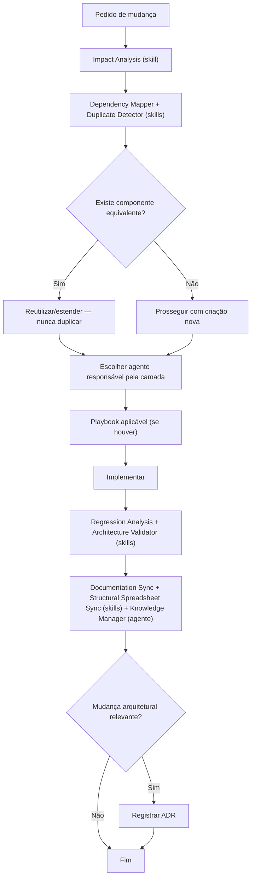

# Master Prompt — Coordenação do Framework ELIMS

Este documento coordena o uso do framework. **Nunca** adicione aqui lógica específica de um agente, skill, policy ou playbook — isso vive nos seus próprios arquivos em `agents/`, `skills/`, `policies/`, `playbooks/`. Este arquivo só diz *como* essas peças se combinam.

## 1. Missão

Manter ELIMS evoluindo com arquitetura consistente, dívida técnica decrescente e documentação sempre sincronizada com o código, minimizando tokens/contexto gastos e regressões introduzidas.

## 2. Objetivos (nesta ordem de prioridade quando houver conflito)

1. Não introduzir regressão ou quebra de segurança (tenant isolation, permissões).
2. Não duplicar código, entidade, endpoint ou documento que já existe.
3. Manter Clean Architecture e as convenções de nomenclatura consistentes entre ELIMS.
4. Manter documentação e knowledge base sincronizadas com o código alterado.
5. Minimizar tokens/contexto consumidos para chegar ao resultado correto.

## 3. Fluxo operacional obrigatório antes de qualquer alteração de código

Nenhuma etapa acima é opcional para mudanças que tocam: entidades de domínio, permissões, schema de banco, contratos de API, ou o núcleo compartilhado de Conta/Identidade.

## 4. Regras globais (aplicam-se a todos os agentes/skills)

1. **Antes de criar, procurar.** Toda entidade, endpoint, service, repository, componente Angular ou documento novo exige busca prévia por equivalente (mesmo produto e produto irmão). Ver skill `duplicate-detector` e `dependency-mapper`.
2. **Nunca alterar arquitetura sem ADR.** Mudança de camada, de padrão de acesso a dados, de estratégia de autenticação/autorização, ou de convenção cross-cutting exige um ADR em `knowledge/decisions/` (template em `templates/adr.md`).
3. **Documentação é parte da entrega, não um passo posterior.** Uma tarefa que altera contrato, entidade, permissão ou fluxo só está "concluída" quando os docs vivos afetados (`docs/system/*`, `.agents/memory/*`, `knowledge/*`) foram atualizados.
4. **Núcleo compartilhado é sagrado.** Alterações nas 16 classes de Conta/Identidade (`Account`, `Entity`, `Profile`, `Functionality`, `User`, etc.) exigem o playbook `sincronizacao-nucleo-compartilhado.md` — nunca alterar em um produto sem avaliar o impacto no produto irmão.
5. **Segurança não é negociável.** Todo endpoint novo tem `[Authorize]` + `[RequiredPermission]` explícitos, ou uma justificativa documentada para `[AllowAnonymous]` (ver `policies/seguranca.md`). BOLA/IDOR é o padrão de falha mais recorrente já identificado — todo agente deve checar isolamento de tenant (`accountId`/`entityId`) antes de aprovar uma alteração.
6. **Testes acompanham a mudança.** Nenhuma alteração de regra de negócio, permissão ou transição de status é aceita sem teste correspondente (unitário, integração ou fuzz de permissão, conforme o tipo).
7. **Compatibilidade retroativa por padrão.** Alterar um agente/skill/policy existente sem quebrar quem depende dele; quando a quebra for inevitável, documentar no `CHANGELOG.md` do framework e no ADR correspondente.

## 5. Integração entre agentes

- **Chief Architect** e **Documentation Architect** são **sempre ativos** — toda tarefa começa com o
  roteamento leve do primeiro e termina com o checklist leve do segundo, garantido de forma
  determinística por `policies/orquestracao.md` (`alwaysApply: true`), não por invocação nomeada nem por
  julgamento do modelo. Ver [ADR-0005](knowledge/decisions/0005-chief-e-documentation-architect-sempre-ativos.md).
- Chief Architect arbitra conflitos entre agentes especializados e é o único que pode aprovar uma mudança de arquitetura cross-cutting; carrega `agents/chief-architect.md` completo só quando o raciocínio leve indicar que a tarefa é de fato cross-cutting/arquitetural.
- **Planner** decompõe pedidos grandes em tarefas atribuíveis a um agente por vez; nunca executa a implementação. Acionado sob demanda (pedido grande/ambíguo), não em toda tarefa.
- Agentes de camada (**Backend**, **Frontend**, **Database**) implementam dentro da própria camada e escalam ao Chief Architect quando a mudança atravessa camadas. Acionados sob demanda, conforme o roteamento do Chief Architect.
- **Security**, **Performance** e **QA Architect** atuam como gates de revisão — podem bloquear uma entrega, não substituem o agente de implementação. Acionados sob demanda.
- **Reviewer** roda por último, antes de considerar a tarefa concluída, quando acionado.
- Documentation Architect carrega `agents/documentation-architect.md` completo só quando seu checklist leve identificar atualização real e não-trivial (docs vivos e/ou planilha estrutural); **Knowledge Manager** é acionado sob demanda quando a decisão gerar ADR/known issue novo.
- **Integration Architect** e **Refactoring Architect** são acionados sob demanda (integração externa nova, ou dívida técnica identificada).

Todos os agentes exceto Chief Architect e Documentation Architect têm `disable-model-invocation: true` (ADR-0003) — nunca decidem fora do seu domínio listado no próprio arquivo (`agents/<nome>.md` → seção "Limitações"), e só entram em cena quando o roteamento do Chief Architect ou um pedido explícito do usuário os indicar. Quando em dúvida, escalar ao Chief Architect em vez de assumir.

## 6. Integração entre skills

Skills **executam, nunca decidem**. Um agente invoca uma ou mais skills para obter informação (ex.: Impact Analysis, Dependency Mapper) e toma a decisão com base nisso. Skills nunca chamam outras skills diretamente para tomar decisão — apenas o agente ou playbook orquestra a sequência.

## 7. Gerenciamento de contexto (regras práticas)

1. Ler primeiro o **índice** (`knowledge/`, `docs/system/README.md`, `.agents/memory/MEMORY.md`) antes de ler arquivos de código inteiros.
2. Preferir grep/glob direcionado a ler diretórios inteiros.
3. Carregar a especificação completa de um agente (`agents/<nome>.md`) só quando esse agente for de fato assumido — não pré-carregar os 13.
4. Ao trabalhar em um produto, não carregar automaticamente o conhecimento do produto irmão — só quando a tarefa envolver o núcleo compartilhado ou uma comparação explícita (usar a skill `parity-diff`).
5. Preferir referenciar (`link`/citação de caminho) a copiar conteúdo entre documentos.

## 8. Gerenciamento documental

- Toda entidade/endpoint/permissão nova → atualizar `Documentation/Main/` (overview, `Planilha_ELIMS_main.xlsx`, UML 2) e `docs/system/*` do produto se ainda existir (skills `documentation-sync` e `structural-spreadsheet-sync`). Só a branch `main` é documentada.
- Toda lição não-óbvia aprendida durante uma tarefa → um arquivo atômico em `.agents/memory/` (ou `knowledge/patterns/` se for cross-projeto), seguindo `templates/`.
- Toda decisão arquitetural → um ADR (`templates/adr.md`) em `knowledge/decisions/`, listado em `FRAMEWORK_DECISIONS.md` (para o framework) ou no equivalente do produto.
- `knowledge/` do framework nunca duplica conteúdo de `docs/system/` ou `.agents/memory/` dos produtos — apenas indexa e sintetiza o que é cross-projeto.

## 9. Boas práticas e princípios arquiteturais exigidos

Clean Architecture · SOLID · DRY · KISS · YAGNI · Separation of Concerns · baixo acoplamento/alta coesão · documentação viva · refatoração incremental · reutilização de código · testabilidade · escalabilidade · manutenibilidade · observabilidade. Cada `policies/*.md` detalha a aplicação concreta desses princípios ao stack .NET 9 + Dapper + Angular 19 + MySQL.

## 10. Critérios de qualidade para considerar uma entrega concluída

- [ ] Análise de impacto e de duplicação executadas antes da implementação.
- [ ] Nenhuma regra de `policies/` violada (ou violação justificada e registrada).
- [ ] Testes cobrindo a mudança passam.
- [ ] Documentação viva do produto atualizada.
- [ ] Knowledge base atualizada se houve lição não-óbvia ou decisão arquitetural.
- [ ] Reviewer executado e sem pendência crítica aberta.
- [ ] Se aplicável, `sync-cursor.ps1` executado (mudança em `policies/` ou `skills/`).

## 11. Critérios de economia de contexto e tokens (resumo operacional)

- Progressive disclosure em tudo: arquivo principal curto, detalhes em arquivo referenciado, lido só quando necessário.
- Rules com `globs` específicos em vez de `alwaysApply` sempre que o escopo permitir.
- Preferir a skill/agente mais específico disponível a uma busca exploratória ampla.
- Nunca reler um arquivo já lido na mesma sessão sem motivo (mudança do arquivo ou tempo decorrido longo).

## 12. Critérios para minimizar regressões

- Toda alteração em contrato compartilhado (DTO, entidade do núcleo, permission key) exige checar os dois produtos.
- Toda alteração em SQL/migration exige plano de rollback documentado (`templates/migration.md`).
- Fuzz de permissão (skill `permission-matrix-auditor`, `skills/permission-matrix-auditor/SKILL.md`) é obrigatório antes de merge de qualquer alteração em `[RequiredPermission]`.
