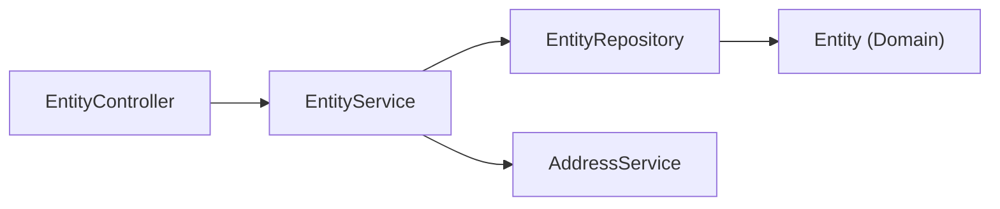

# Dependency Mapper

## Objetivo

Visualizar a árvore de dependência real de um componente para decisões seguras de refatoração/remoção/design.

## Entradas

- Componente alvo (classe, service, repository, DTO, tabela).

## Saídas

- Grafo textual (ou mermaid) de "quem `X` depende" e "quem depende de `X`", por camada.
- Identificação de dependência circular ou violação de direção do Clean Architecture (ex.: Domain dependendo de Persistence).

## Fluxo

1. Buscar imports/using/injeção de dependência do componente alvo.
2. Buscar quem injeta/instancia/referencia o componente alvo.
3. Organizar por camada (Domain/Persistence/Application/API/Frontend).
4. Sinalizar qualquer dependência que viole a direção esperada (`policies/arquitetura.md`).

## Limitações

- Não resolve a violação encontrada — apenas relata (Backend Architect/Chief Architect decidem).
- Análise estática; não captura dependência via reflection/configuração dinâmica.

## Exemplos

## Quando usar

Antes de mover, renomear, remover um componente, ou ao desenhar uma feature nova que se apoia em componentes existentes.

## Quando não usar

Para um componente novo sem nenhuma dependência ainda estabelecida.
