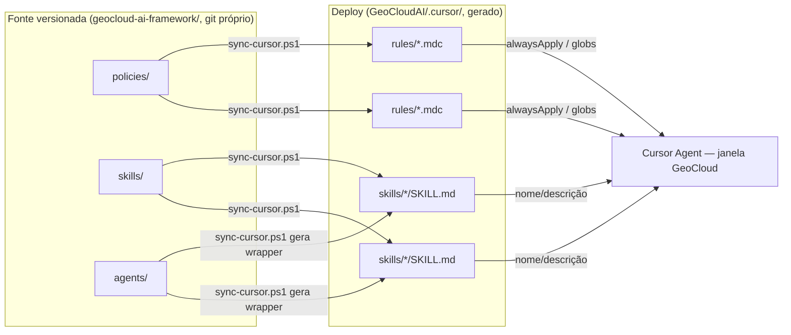
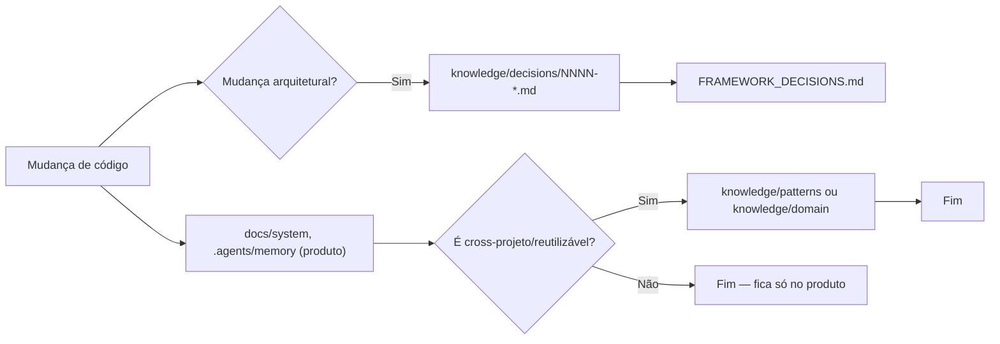

# Arquitetura do Framework

## Visão geral

O `geocloud-ai-framework` é um projeto de conhecimento e processo — não um projeto de código de produto. Ele existe para ser lido por agentes de IA (e humanos) antes e durante o trabalho em GeoCloud, e para capturar de volta o que foi aprendido.

## Objetivos arquiteturais

1. **Fonte única da verdade por tipo de conteúdo** — nunca duplicar a mesma informação em dois lugares. Decisão vive em `knowledge/decisions/`; convenção vive em `policies/`; processo vive em `playbooks/`; conhecimento factual sobre o domínio vive em `knowledge/domain/` ou no `docs/` do produto.
2. **Máxima reutilização dos recursos nativos do Cursor** — Skills e Rules do Cursor substituem o que seria um "motor de skills/policies" customizado (ver [ADR-0001](knowledge/decisions/0001-skills-e-rules-nativas-do-cursor.md)).
3. **Independência de produto** — o framework não depende de estar dentro de nenhum produto específico; ele referencia GeoCloud por caminho relativo, nunca os incorpora.
4. **Federação da knowledge base** — detalhes ficam perto do código que descrevem; o framework só agrega o que é cross-projeto (ver [ADR-0002](knowledge/decisions/0002-knowledge-base-federada.md)).
5. **Agentes como personas de prompt, não como motor de orquestração** — não existe (nem se tenta recriar) um "runtime de multiagentes" customizado; agentes são especificações de comportamento que qualquer sessão de IA pode adotar (ver [ADR-0003](knowledge/decisions/0003-agentes-como-personas-de-prompt.md)).
6. **Roteamento e documentação garantidos deterministicamente, não por julgamento do modelo** — Chief Architect (roteamento) e Documentation Architect (checklist de docs) são os dois únicos agentes sempre ativos em toda tarefa, via `policies/orquestracao.md` (`alwaysApply: true`); os demais 11 permanecem sob demanda (ver [ADR-0005](knowledge/decisions/0005-chief-e-documentation-architect-sempre-ativos.md)).

## Responsabilidades por diretório

| Diretório | Responsabilidade | Quem edita | Quem consome |
|---|---|---|---|
| `agents/` | Especificação completa de cada persona especializada | Chief Architect / Knowledge Manager | Qualquer sessão de IA que assume o papel |
| `skills/` | Execução determinística de uma tarefa especializada (SKILL.md nativo Cursor) | Knowledge Manager | Cursor (auto-load) e agentes |
| `policies/` | Regra permanente, fonte de `.cursor/rules/*.mdc` | Chief Architect | Todos os agentes/skills; Cursor (via sync) |
| `playbooks/` | Processo ponta-a-ponta para um tipo de tarefa recorrente | Planner | Qualquer agente ao iniciar uma tarefa desse tipo |
| `templates/` | Modelo de documento reutilizável | Documentation Architect | Qualquer agente ao criar o documento correspondente |
| `knowledge/` | Índice + síntese cross-projeto | Knowledge Manager | Todos |
| `scripts/` | Automação do próprio framework | Knowledge Manager | CI local / execução manual |
| `tests/` | Auto-validação estrutural do framework | Knowledge Manager | CI local / execução manual |

## Inventário de skills (19)

| Skill | Propósito em 1 linha |
|---|---|
| `context-builder` | Monta o contexto mínimo necessário para uma tarefa (progressive disclosure). |
| `duplicate-detector` | Verifica se já existe entidade/endpoint/componente equivalente antes de criar um novo. |
| `dependency-mapper` | Mapeia quem depende de um componente (consumidores diretos/indiretos). |
| `impact-analysis` | Mapeia o que quebra ao alterar contrato/entidade/permissão/schema, antes de implementar. |
| `regression-analysis` | Mapeia consumidores/testes antes de refatorar ou corrigir bug em código compartilhado. |
| `architecture-validator` | Verifica direção de dependência do Clean Architecture (camadas). |
| `naming-validator` | Verifica convenção de nomenclatura (PT→EN, sufixos, permission keys). |
| `endpoint-scanner` | Inventário estático de endpoints × atributos de autorização. |
| `permission-matrix-auditor` | Audita provisionamento/severidade de `[RequiredPermission]` a partir do `endpoint-scanner`. |
| `database-diff` | Compara schema do banco vivo com o que o código assume. |
| `dead-code-detector` | Encontra código sem nenhuma referência ativa. |
| `code-smell-detector` | Sinaliza padrões problemáticos (duplicação, complexidade, acoplamento). |
| `test-coverage-analyzer` | Mede cobertura de teste de um componente/área. |
| `refactoring-assistant` | Aplica refatoração incremental preservando comportamento. |
| `uml-generator` | Gera diagrama (classe/sequência) a partir do código real. |
| `parity-diff` | Compara núcleo compartilhado entre GeoCloud. |
| `documentation-sync` | Localiza documentação viva desatualizada em relação ao código. |
| `structural-spreadsheet-sync` | Mantém as planilhas estruturais canônicas (CSV/XLSX) sincronizadas com o código. |
| `framework-sync` | Sincroniza `geocloud-ai-framework/` com `.cursor/rules/` e `.cursor/skills/` do workspace. |

## Fluxo de contexto

O `geocloud-ai-framework` tem remoto próprio no GitHub (`sergio-essencislabs/geocloud-ai-framework`). Os produtos
(`GeoCloudAI`, `GeoCloudAI`) são repositórios separados, cada um aberto em
sua janela do Cursor. Por isso `sync-cursor.ps1` gera o `.cursor/` dentro de **cada repositório de
produto** (lista em `$deployTargets`) — a janela do produto enxerga rules/skills sem depender de
`GeoCloud` estar aberta como workspace.

## Fluxo documental

## Estratégia de evolução

O framework evolui por ADR + PR (mesmo sendo um repositório de conhecimento). Qualquer novo agente/skill/policy/playbook exige, antes de ser criado:

1. Busca exaustiva por equivalente existente (regra global do `MASTER_PROMPT.md`).
2. Justificativa concreta baseada em evidência do código (não hipotética) — ver critério aplicado em cada componente deste framework (todo agente/skill "mínimo esperado" adicional foi justificado com achados reais da Fase 1 de descoberta, registrados em `knowledge/known-issues/`).
3. Registro no `CHANGELOG.md` e, se mudar a arquitetura do próprio framework, um ADR.

## Estratégia de versionamento

- SemVer em `VERSION` (`MAJOR.MINOR.PATCH`).
  - `MAJOR`: remoção/quebra de agente, skill, policy ou playbook existente.
  - `MINOR`: novo agente/skill/policy/playbook/template, ou nova seção relevante na knowledge base.
  - `PATCH`: correção de conteúdo, erro de link, ajuste de texto sem mudança de comportamento.
- Cada release relevante documentada em `CHANGELOG.md` (formato Keep a Changelog).
- Git próprio (`geocloud-ai-framework/.git`), independente dos repositórios de produto
  (`GeoCloudAI`, `GeoCloudAI`). Remoto do framework:
  `github.com/sergio-essencislabs/geocloud-ai-framework`.

## Estratégia de manutenção

- `scripts/validate-framework.ps1` roda antes de qualquer commit que altere `skills/` ou `policies/` (frontmatter válido, tamanho de SKILL.md, links não quebrados).
- `scripts/sync-cursor.ps1` roda após qualquer alteração em `skills/` ou `policies/` — o `.cursor/` gerado nunca é a fonte da verdade.
- Revisão trimestral (ou por gatilho de bug recorrente) do `FRAMEWORK_ROADMAP.md` pelo Chief Architect + Knowledge Manager.

## Estratégia para economia de contexto

Ver `MASTER_PROMPT.md` §7 e §11. Resumo estrutural: cada camada do framework (agente → skill → policy → knowledge) é carregada sob demanda e nunca pré-carregada por completo; o único conteúdo `alwaysApply` é o essencial de segurança/versionamento/documentação/orquestração, mantido deliberadamente curto — inclusive o roteamento de Chief Architect e o checklist de Documentation Architect (`policies/orquestracao.md`), que são versões *leves* das especificações completas em `agents/`, carregadas por extenso só quando o próprio raciocínio leve indicar necessidade.

## Estratégia para minimizar tokens

- SKILL.md sob 500 linhas (limite do Cursor) com progressive disclosure (`reference.md` separado quando necessário).
- Rules sob 50 linhas cada, uma preocupação por rule.
- Agentes usam wrapper curto no Cursor; especificação completa só é lida quando o papel é assumido.
- Knowledge base federada evita indexar duas vezes o mesmo fato.

## Estratégia para atualização automática da documentação

- A skill `documentation-sync` é acionada pelo playbook `atualizacao-documental.md` e pela regra 3 da seção 4 do `MASTER_PROMPT.md` sempre que uma tarefa altera contrato/entidade/permissão/fluxo.
- A skill `structural-spreadsheet-sync` mantém a planilha estrutural canônica
  (`GeoCloudAI/Documentation/Main/GeoCloud.xlsx`) sincronizada com o mesmo
  gatilho — planilha única, só da branch `main`.
- `scripts/validate-framework.ps1` detecta docs do framework com referências a arquivos que não existem mais (drift estrutural do próprio framework).
- Cada produto mantém seu próprio mecanismo de docs vivos (`docs/system/*`, `.agents/memory/*`); o framework não tenta centralizá-los, apenas garante (via policy `documentacao.md`) que toda tarefa os atualize.
