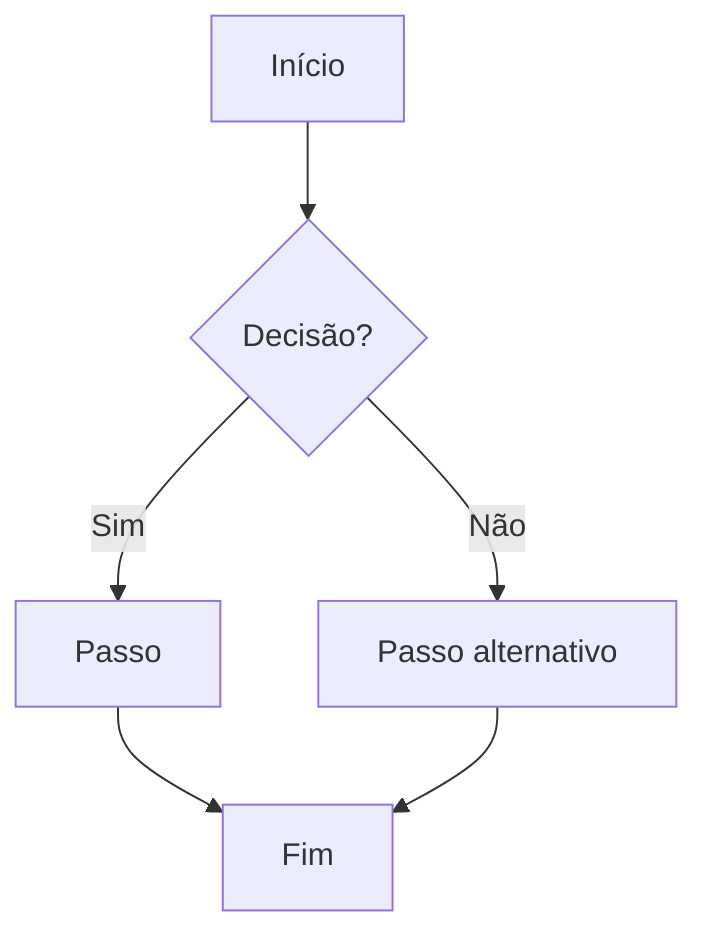

# Fluxo: <nome>

```mermaid
flowchart TD
    A[Início] --> B{Decisão?}
    B -->|Sim| C[Passo]
    B -->|Não| D[Passo alternativo]
    C --> E[Fim]
    D --> E[Fim]
```

## Observações

- <O que foi omitido de propósito, se algo (ex.: vínculos de auditoria).>
- <Onde este fluxo está implementado no código — referência de arquivo.>
